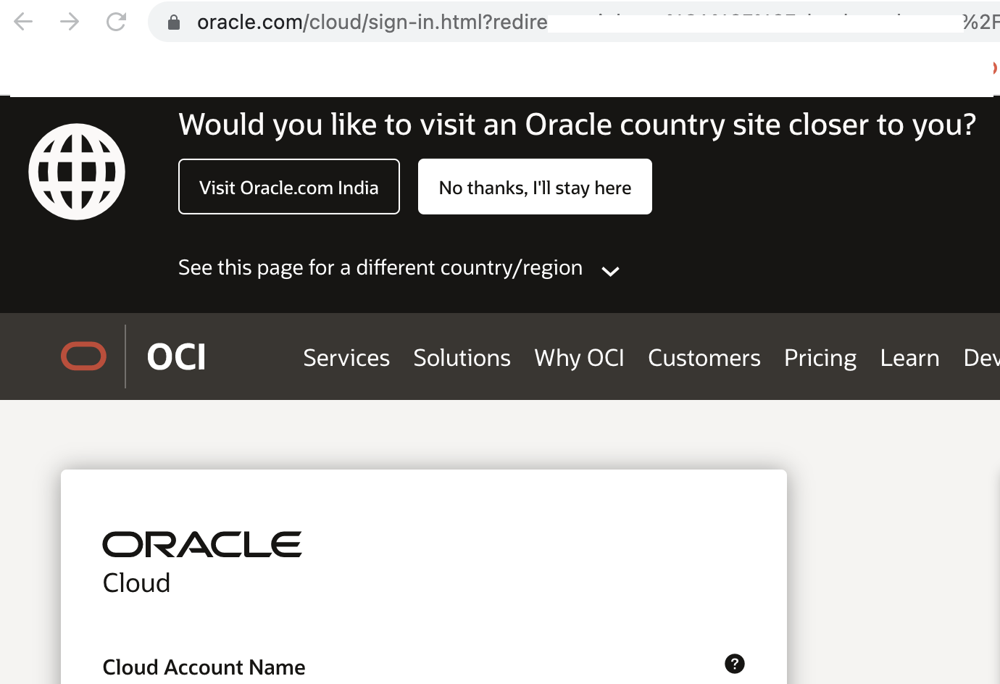

Manage policies and dynamic groups for compartments from tenancy .

------------

Objectives 
---

- Manage policies and dynamic groups for compartments from root tenancy.
- Deploy the resources under root tenancy using terraform stack .
- Manage a resource manager stack drifft and validate /import the changes. 


Sample Deploy Using Oracle Resource Manager
--------- 

Click Here to Deploy - [](https://cloud.oracle.com/resourcemanager/stacks/create?region=home&zipUrl=https://github.com/RahulMR42/oci-devops-centralized-policy-with-rms-stack/releases/latest/download/oci-devops-centralized-policy-with-rms-stack-latest.zip)


Alternate approach
---
- Its another way of approach where in the policies are defined with in the compartment space . - https://github.com/oracle-devrel/oci-devops-examples/tree/main/oci-config-examples/oci_devops_policy_dg_terraform 

Detailed Procedure
---------

- For this illustrations we are considering two compartments ,the( file [compartment1.tf](compartment1.tf) consist of terraform definition for compartment 1 and file [compartment2.tf](compartment2.tf) for compartment2.

- You need to create two OCI compartments to test this - https://docs.oracle.com/en-us/iaas/Content/Identity/Tasks/managingcompartments.htm#Working 

- The related variables are declared under file [variables.tf](variables.tf) .

- As this managed using oracle resource manager , the authorization and authentication towards resources will be managed by the OCI resource manager against the logging information.

- Click on the `Deploy to Oracle Cloud` button .

    [](https://cloud.oracle.com/resourcemanager/stacks/create?region=home&zipUrl=https://github.com/RahulMR42/oci-devops-centralized-policy-with-rms-stack/releases/latest/download/oci-devops-centralized-policy-with-rms-stack-latest.zip)


- Login to OCI console.



- Accept the terms and select a compartment to run the stack (use the tenancy root )

- In the next stage provide the compartment OCIds. 


- Use `Next` and `Create` - With `Run Apply` option checked.


- Wait for the stack job to complete .


- Check the stack logs and view the execution status.


- Switch to `Identity` > `Dynamic Groups` and you should see two dynamic group created.


Run a stack Drift
------

- Drift is the difference between the actual, real-world state of your infrastructure and the stack's last executed configuration. For example, drift occurs when a team member adds a production tag to your resources, or when a resource is deleted.


- Switch to `Identity` > `Dynamic Groups` > Click on one of the created dynamic group and select `Edit Matching Rule` and add an Additional Rule  save.

```
resource.type = 'devopsbuildpipeline'
```


- Switch to `Resource Manager` > `Stacks` > Name of the Stack 

- Click `Run drift detection now` link.


- Use all resources and Run .


- Wait for the job to finish .


- Use the 3 dots and view the drift detection report.


- Click on the `show` option on the `Modified` resource , with actual properties.

![])images/oci_detection_report.png


- You may copy the changes to stack defenition (tf files)  and apply the stack 

```
resource "oci_identity_dynamic_group" "devopsgroup1" {
  provider       = oci.home_region
  name           = "devops_dg_compart1"
  description    = "DevOps deploy pipeline dynamic group"
  compartment_id = var.tenancy_ocid
  matching_rule  = "ALL {resource.type = 'devopsdeploypipeline', resource.compartment.id = '${var.compartment1_ocid}',resource.type = 'devopsbuildpipeline}"
}
```

**Another Way to manage the unmanaged resource** 

- Follow terraform import state / Update the defenition with out an additional apply Job .

- Details can be found here - https://docs.oracle.com/en-us/iaas/Content/ResourceManager/Tasks/managingstacksandjobs.htm#StackManaging (Under section - `Update the state file using Terraform CLI` )


- Always ensure to run `Destroy` job and wait for its sucesful completion and using  `More actions` delete the stack .


How to use `Deploy to Oracle Cloud` option.
-------

- Ensure to a Github release once your code changes are completed. - https://docs.github.com/en/repositories/releasing-projects-on-github/managing-releases-in-a-repository

- Using your Github repo ,create a new release .


- Provide a tag and name and create a release.


- Under the release > Assets ,click on Source code (zip) and download .

- Rename it with `reponame`-latest.zip 

```
Example : oci-devops-centralized-policy-with-rms-stack-latest.zip 
```

- Edit the release and upload it back under asset.


- Verify the upload.


- Use the auto deploy button as below .


```
 [](https://cloud.oracle.com/resourcemanager/stacks/create?region=home&zipUrl=https://github.com/< GIT USER NAME >/< GIT REPO NAME  > /releases/latest/download/< GIT REPO NAME > -latest.zip)

 ```

 - You may use repo with other means source for resource manager as well - (using files as is ,or adding as one of the source code provider ) - Refer here for more - https://docs.oracle.com/en-us/iaas/Content/ResourceManager/Tasks/managingconfigurationsourceproviders.htm 

Contributors 
----

- Author : Rahul M R.
- Collaborators : NA
- Last release : May 2022


